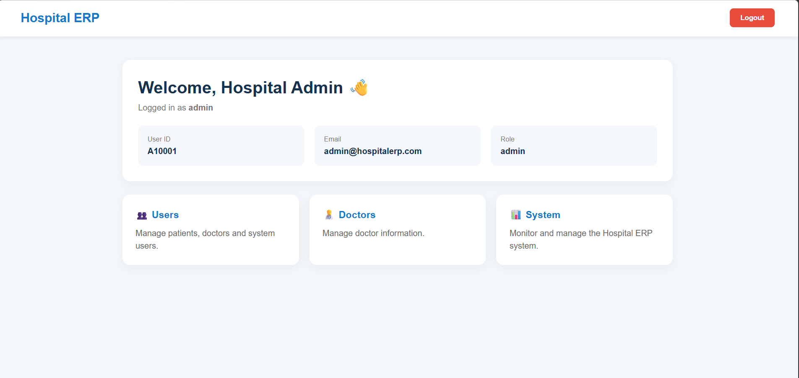
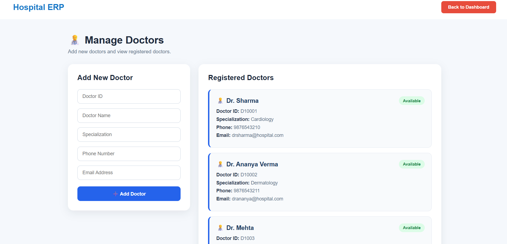
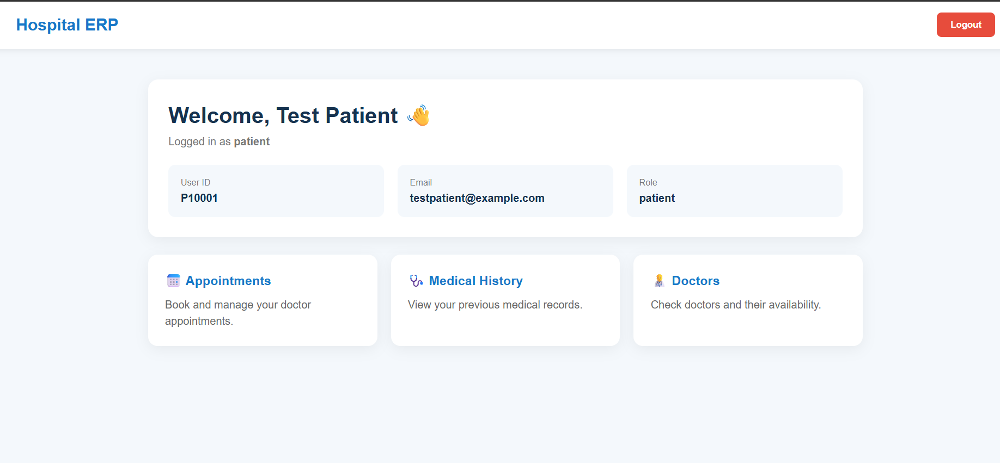
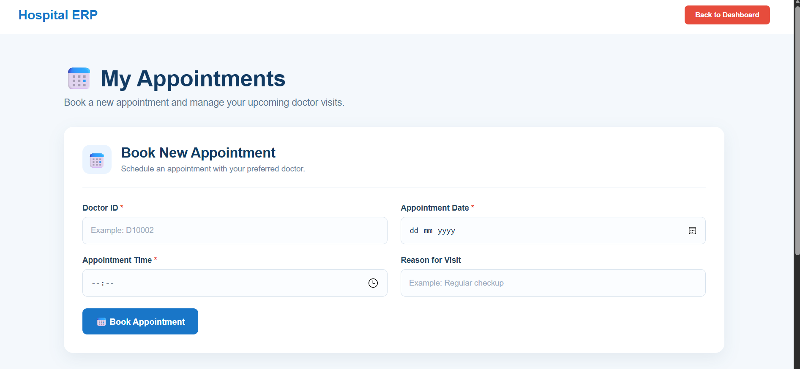
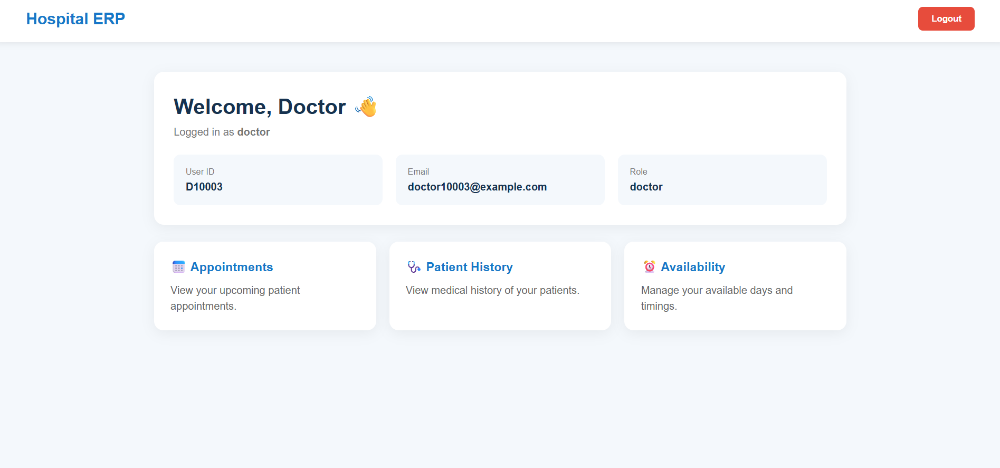

# 🏥 Hospital ERP

A full-stack Hospital Enterprise Resource Planning (ERP) system built to simplify and manage hospital operations through a centralized web application.

## 📌 Overview

Hospital ERP is a role-based hospital management system developed using the MERN stack.

The system provides separate functionality for **Patients, Doctors, and Administrators**, allowing users to manage appointments, doctor availability, medical history, doctors, and registered users from one platform.

## ✨ Features

### 👤 Patient

- Secure login using User ID and password
- View available doctors
- View doctor information and specialization
- Book appointments with doctors
- Select appointment date and time
- View booked appointments
- View personal medical history

### 👨‍⚕️ Doctor

- Secure doctor login
- View appointments booked by patients
- Manage weekly availability
- Set available days and working hours
- Update availability and leave information
- Search and view patient medical history

### 👨‍💼 Admin

- Secure admin login
- View registered users
- View individual user details
- Add and manage doctor information
- View registered doctors
- Role-based access to administrative features
  
## 📸 Screenshots

### 👨‍💼 Admin Dashboard


### 👨‍⚕️ Manage Doctors


### 🧑‍💻 Patient Dashboard


### 📅 Doctor Appointments


### 🩺 Doctor Dashboard


## 🛠️ Tech Stack

### Frontend

- React.js
- JavaScript
- HTML
- CSS
- Vite

### Backend

- Node.js
- Express.js
- REST API

### Database

- MongoDB
- Mongoose

### Authentication & Security

- JWT (JSON Web Token)
- bcrypt.js
- Role-Based Access Control

## 🔐 Authentication

The application uses JWT-based authentication.

Different users are provided access according to their roles:

- `Admin`
- `Doctor`
- `Patient`

Passwords are securely hashed using bcrypt before being stored in the database.

## 📂 Project Structure

```text
Hospital-ERP/
│
├── src/
│   ├── pages/
│   ├── services/
│   ├── App.jsx
│   ├── App.css
│   └── main.jsx
│
├── server/
│   ├── middleware/
│   ├── models/
│   ├── routes/
│   └── server.js
│
├── public/
├── package.json
├── vite.config.js
└── README.md
